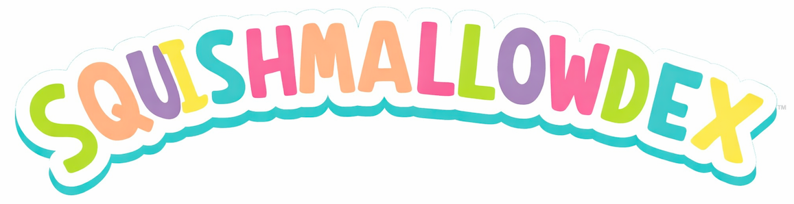

# Squishmallowdex

**Your Squishmallow collection tracker - like a Pokedex, but for Squishmallows!**

Welcome to a cozy, colorful collector's guide. Squishmallowdex gathers info from the wiki and turns it into a magical, searchable collection you can open anytime.

🌐 **[Browse the Live Collection](https://squishmallowdex.com)** - Try it now!

---

## What You'll Get

- A big, searchable collection with pictures — switch between **table** and **card** views
- Favourites and ownership tracking (hearts and checkboxes), synced across both views
- Filter by name, favorites-only, or owned-only; sort by name, type, year, collector number, and more
- **Compact card mode** for power browsers; card view remembered across reloads
- Amazon affiliate buy buttons on every entry
- Works offline after it is built
- Kid-friendly, easy to browse on desktop, tablet, or phone

---

## Quick Start (No Terminal Needed)

1. **Download the project**
   - Click the green **Code** button and choose **Download ZIP**
2. **Unzip it**
   - You will see a folder named `squishmallowdex`
3. **Open the folder**
4. **Run the setup helper**
   - On Mac/Linux, **right-click `setup.sh` and choose Open With -> Terminal**
   - On Windows, **double-click `setup.bat`**
   - A small window opens and installs everything for you

If your computer asks, choose **Open** or **Run**. It is safe and only installs what the project needs.

---

## After Setup: Your Collection

You will see files like:

- `squishmallowdex.html` - This is your beautiful collection page

Tip: You can open the HTML file anytime (no internet needed once it is built).

---

## Need Help?

If something does not work:

- Do not worry - take a deep squishy breath
- Ask a grown-up or a tech-savvy friend for help
- See the [Usage Guide](https://squishmallowdex.com/guide.html)

---

## Use on Phone or Tablet

Want to browse your collection on the go?

1. Transfer `squishmallowdex.html` to your phone
2. Open it in Safari or Chrome
3. Tap **Share** then **Add to Home Screen**

Now it looks like an app and works offline.

---

## Documentation

- [About](https://squishmallowdex.com/about.html)
- [Usage Guide](https://squishmallowdex.com/guide.html)
- [Roadmap](ROADMAP.md)

---

**Gotta Squish 'Em All!**

*Made with love for young collectors who want to learn along the way.*
